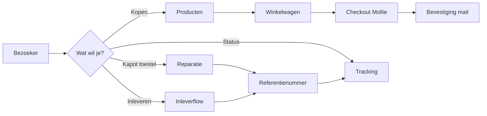
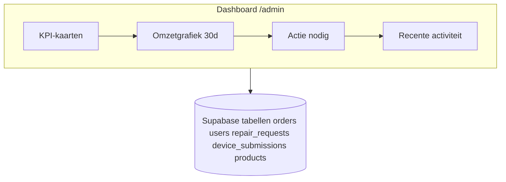
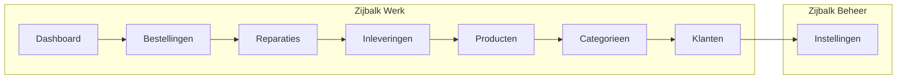

<div align="center">

# TelFixer

[](https://telfixer.nl)

<br />


<br />

<sub>Huiskleuren: diep teal <code>#094543</code>, room <code>#FAF8F5</code>, champagne <code>#F5EDE2</code>, koperaccent <code>#B87333</code>. Zelfde basis als de live site.</sub>

</div>

<br />

---

<br />

## Inhoudsopgave

1. [Kort voor wie dit is](#kort-voor-wie-dit-is)
2. [Wat TelFixer publiek doet](#wat-telfixer-publiek-doet)
3. [Hoe het admin-dashboard werkt](#hoe-het-admin-dashboard-werkt)
4. [Plattegrond van het dashboard](#plattegrond-van-het-dashboard)
5. [De secties in het admin (per pagina)](#de-secties-in-het-admin-per-pagina)
6. [Techniek en koppelingen](#techniek-en-koppelingen)
7. [MCP voor AI-clients](#mcp-voor-ai-clients)
8. [Lokaal ontwikkelen](#lokaal-ontwikkelen)

<br />

---

<br />

## Kort voor wie dit is

TelFixer is een **Nederlandstalige** webwinkel en service rond **gerepareerde telefoons** en aanverwante elektronica, met werkplaats in **Ede (Gelderland)**. Bezoekers kunnen **producten kopen**, een **reparatie aanvragen**, een **apparaat inleveren**, en overal **tracking** gebruiken. Achter de schermen draait een **admin-dashboard** voor orders, reparaties, inleveringen, catalogus, klanten en instellingen.

Alles hieronder staat in **gewoon Nederlands**: geen pakketjes-jargon, wel precies genoeg detail voor iemand die de repo opent of de site wil begrijpen.

<br />

---

<br />

## Wat TelFixer publiek doet

### Hoofdlijnen

| Route | Wat gebeurt er |
|-------|----------------|
| `/` | Homepage met aanbod, uitstraling en doorverwijzing naar shop en diensten |
| `/producten` | Catalogus met filters op categorie |
| `/producten/[slug]` | Productdetail, voorraad, in winkelwagen |
| `/winkelwagen` | Mandje beheren |
| `/checkout` | Afrekenen (Mollie) |
| `/reparatie` | Formulier reparatieaanvraag, referentie voor vervolg |
| `/inleveren` | Apparaat aanbieden, eigen flow met bevestiging |
| `/tracking` | Status opzoeken op referentie (bijv. `TF-…`) |
| `/login`, `/registreren` | Account |
| `/account` | Profiel, bestellingen, reparaties, inleveringen |
| `/contact`, `/faq`, `/garantie`, `/over-ons`, `/privacy`, `/voorwaarden` | Informatie en vertrouwen |

### Stroom in het kort



De app gebruikt **Supabase** voor data en sessies, **Mollie** voor betalingen, **Resend** voor mail. Dat zie je terug in de code en in de admin (betaalstatus, klantmail, enzovoort).

<br />

<details>
<summary><strong>Uitklappen: account versus anoniem</strong></summary>

<br />

Je kunt **reparatie en tracking** volgen met een referentie zonder ingelogd te zijn. Met **account** bundel je bestellingen en dossiers in je profiel. Hoe strak checkout aan login koppelt, volgt uit jullie instellingen in de app. De admin gebruikt dezelfde databasetabellen voor iedere klant.

<br />
</details>

<br />

---

<br />

## Hoe het admin-dashboard werkt

Het admin zit onder **`/admin`**. Het is **geen** aparte app: het is gewoon Next.js met een **eigen layout** (sidebar, bovenbalk, zoekveld). Je komt er alleen in als je **ingelogd** bent én in de database in de tabel **`admins`** een rij hebt gekoppeld aan je Supabase-user.

### Toegang stap voor stap

1. Je logt in op de gewone site (`/login`).
2. De layout laadt en vraagt aan Supabase: bestaat er een rij in `admins` voor dit `user_id`?
3. **Ja:** je ziet het dashboard, met rol **Administrator** of **Support** (wordt onder je naam getoond).
4. **Nee:** je wordt teruggestuurd naar de homepage met een duidelijke **geen toegang**-melding.
5. **Niet ingelogd:** redirect naar `/login?redirect=/admin`.

Zo blijft de winkel voor iedereen bereikbaar, maar het beheer alleen voor mensen die je zelf in `admins` zet.

### Wat je op elk scherm terugziet

- **Zijbalk** met vaste navigatie en een knop **Nieuw aanmaken** (snelkoppeling naar nieuw product of categoriebeheer).
- **Bovenbalk** met **globaal zoeken**: bestellingen, reparaties, inleveringen, producten, klanten. Sneltoets **Ctrl+K** of **Cmd+K** focust het veld (zoals op veel moderne apps).
- **Hoofdvlak** met de pagina-inhoud: overal dezelfde maximale breedte en rustige typografie, passend bij de TelFixer-huisstijl maar dan in een **compacte admin-schaal**.

### Het startdashboard (`/admin`)

Dit is het hart van het overzicht. Data komt **live uit Supabase** (client-side queries na mount).

| Onderdeel | Uitleg |
|-----------|--------|
| **KPI-kaarten** | Omzet laatste 30 dagen (alleen **betaalde** orders), trend t.o.v. de 30 dagen daarvoor. Hetzelfde voor **aantal bestellingen**. Daarnaast **klanten totaal** en **nieuwe klanten in 30 dagen**. Tot slot **open acties**: een som van dingen die aandacht vragen (zie hieronder). |
| **Staafgrafiek omzet** | Per dag in de laatste 30 dagen, opgebouwd uit betaalde orders. Onder de grafiek: totaal, gemiddeld per dag, en **AOV** (omzet gedeeld door aantal orders in die periode). |
| **Actie nodig** | Vier tellers met links: bestellingen met status **in behandeling**, reparaties met status **ontvangen** of **in behandeling**, inleveringen met **ontvangen** of **evaluatie**, en **actieve producten zonder voorraad**. Dit is je werkvoorraad. |
| **Recente activiteit** | Tot tien regels, gemengd: laatste bestellingen, reparaties en inleveringen, op tijd gesorteerd. Per regel status, bedrag (orders), en relatieve tijd (zojuist, minuten, uren, dagen). |
| **Snelkoppelingen** | Onderaan o.a. naar nieuw product, categorieën en instellingen. |



<br />

[](https://telfixer.nl/admin)

<br />

---

<br />

## Plattegrond van het dashboard



**Werk** is alles wat dagelijks binnenkomt. **Beheer** is configuratie (bedrijf, verzending, content, garanties, enzovoort).

<br />

---

<br />

## De secties in het admin (per pagina)

### Bestellingen (`/admin/bestellingen`)

Lijst van orders met filter op status waar de UI dat ondersteunt. Detailpagina per order: klantgegevens, regels, betalingsstatus, verzendinformatie. Handig om **in behandeling** weg te werken en door te zetten naar verzonden of afgerond, afhankelijk van jullie proces.

### Reparaties (`/admin/reparaties`)

Alle **repair requests** met hun statussen. Detail: apparaat, klant, beschrijving, interne opvolging. Sluit aan op het publieke reparatieformulier en op tracking.

### Inleveringen (`/admin/inleveringen`)

**Device submissions**: mensen die een toestel willen inleveren. Status zoals ontvangen en evaluatie komt overeen met de tellers op het dashboard. Detailpagina voor beoordeling en communicatie.

### Producten (`/admin/producten`)

Catalogusbeheer: actief of niet, voorraad, prijzen, gekoppelde categorie. Route **Nieuw product** voor toevoegen. Uitverkochte maar nog actieve items voeden de **uitverkocht**-waarschuwing op het dashboard.

### Categorieën (`/admin/categorieen`)

Boom of lijst van productcategorieën voor de shop en filters. Koppeling met producten blijft consistent met de publieke navigatie.

### Klanten (`/admin/klanten`)

Gebruikers uit de `users`-tabel: wie heeft geregistreerd, mail, naam. Detail voor support en historie.

### Instellingen (`/admin/instellingen`)

Centrale plek voor **bedrijfsgegevens** (naam, mail, telefoon, adres, KVK, BTW), **verzending** (kosten, drempel gratis verzending, levertijdtekst), **BTW-tarief**, **garantieperiodes** per producttype, **social links**, **contentteksten** (o.a. labels en mails), **over-ons statistieken**, **Google reviews**-blok, en meer. Wat je hier wijzigt, straalt vaak direct uit naar de site of naar mails. Alles wordt uit Supabase gelezen en opgeslagen via de admin-formulieren.

<br />

---

<br />

## Techniek en koppelingen

| Laag | Keuze |
|------|--------|
| Framework | **Next.js 16** (App Router), **React 19** |
| Taal | **TypeScript** |
| Styling | **Tailwind CSS 4**, eigen design tokens (cream, champagne, primary teal, koper, gold) |
| Data | **Supabase** (Postgres, Row Level Security waar van toepassing, client en server helpers) |
| Betaling | **Mollie** |
| E-mail | **Resend** |
| Formulieren | **React Hook Form** + **Zod** |
| State (o.a. winkelwagen) | **Zustand** + context waar nodig |
| Animaties op de site | o.a. **Framer Motion** op publieke pagina’s |
| Integratie AI | **Model Context Protocol** (`@modelcontextprotocol/sdk`) op `/api/mcp` |

### Publieke API-documentatie

OpenAPI voor externe integraties en leesbare docs:

**https://telfixer.nl/api/v1/public/docs**

<br />

---

<br />

## MCP voor AI-clients

Agents (zoals Claude Desktop) kunnen TelFixer benaderen via **MCP**. Transport: **streamable HTTP**.

| Resource | URL |
|----------|-----|
| Server card (metadata) | `https://telfixer.nl/well-known/mcp/server-card.json` |
| MCP-endpoint | `https://telfixer.nl/api/mcp` |
| OpenAPI (zie hierboven) | `https://telfixer.nl/api/v1/public/docs` |

Servernaam in software: **`telfixer-mcp`**. In de gepubliceerde card staat **geen login** op de MCP zelf.

### Tools

| Tool | Functie |
|------|---------|
| `track_repair` | Status ophalen op referentie of ordernummer |
| `get_product_categories` | Actieve categorieën + aantal producten |
| `create_repair_request` | Nieuwe reparatie melden (valideert o.a. Nederlands mobiel 10 cijfers) |

### Claude Desktop (stdio-brug)

Claude Desktop verwacht een **lokaal proces**. Gebruik **`mcp-remote`** naar het endpoint.

**Bestand:** `~/Library/Application Support/Claude/claude_desktop_config.json` (macOS) of `%APPDATA%\Claude\claude_desktop_config.json` (Windows).

```json
{
  "mcpServers": {
    "telfixer": {
      "command": "npx",
      "args": [
        "-y",
        "mcp-remote@latest",
        "https://telfixer.nl/api/mcp",
        "--transport",
        "http-only"
      ]
    }
  }
}
```

Herstart Claude volledig na wijzigingen. Als `http-only` problemen geeft: laat `--transport` en `http-only` weg en probeer opnieuw (standaard is vaak `http-first`).

### Cursor en andere editors

Configureer in je MCP-json (bijv. `~/.cursor/mcp.json`) of gebruik dezelfde **`mcp-remote`**-opzet als hierboven als je editor geen raw HTTP naar MCP ondersteunt.

<br />

---

<br />

## Lokaal ontwikkelen

```bash
git clone <jouw-repo-url>
cd TelFixer
npm install
npm run dev
```

Open **http://localhost:3000**. Zet **omgevingsvariabelen** klaar voor Supabase, Mollie en Resend voordat je checkout of mail test. Er zit geen `.env.example` in deze repo; kopieer de keys uit je Supabase- en Mollie-dashboard naar je lokale `.env.local`.

```bash
npm run build    # productiebuild controleren
npm run lint     # ESLint
```

<br />

---

<br />

<div align="center">

**https://telfixer.nl**

*Ede, Gelderland*

<br />

<sub>README voor ontwikkelaars en partners. Voor klantvragen: contactpagina op de site.</sub>

</div>
